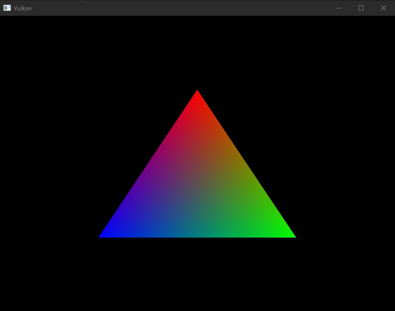

# Vulkan tutorial

Recreando el [tutorial de Vulkan](https://vulkan-tutorial.com) en Rust usando Vulkano y el código de este [tutorial](https://github.com/bwasty/vulkan-tutorial-rs)

Se están usando las versiones 0.20 de Vulkano y 0.24 de winit y por lo tanto fue necesario cambiar algunas de las funciones con respecto a los tutoriales que se están siguiendo como ejemplo. Principalmente el use del Eventloop en winit cambió. 

Hasta ahora se tiene completada la parte de representación de un triángulo en una ventana usando un swapchain y recreandolo cuando la ventana cambia sus propiedades. 

Después de 700 líneas de código se obtiene este triángulo en una ventana que acepta cambios de tamaño

